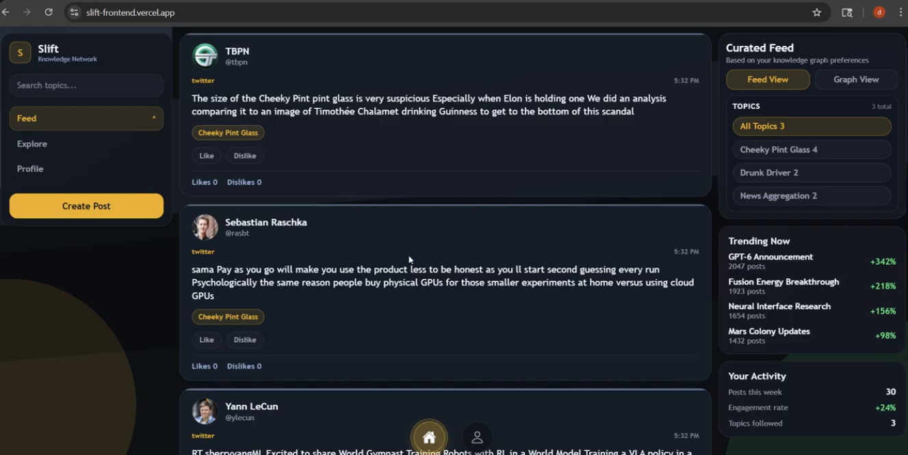

# Slift Frontend

## Click below to watch demo

## NOTE
We have turned off frontend and backend. But if you message us we can set it up again, easily.

## Install And Run

1. `bun install`
2. `bun run start`
3. Optional platforms: `bun run android`, `bun run ios`, `bun run web`

## Tests

Run all tests:

- `bun run test`

This uses Bun's test runner and preloads `tests/setup.ts` for React Native mocks.

## API Contract

The frontend now uses an OpenAPI protocol contract for GET and POST endpoint
request/response types.

- OpenAPI source of truth: `contracts/openapi.json`
- Frontend contract bindings: `src/contracts.ts`
- Contract consistency test: `tests/openapi-contract.test.ts`
- Run only contract test: `bun run test:contract`

When backend response shapes change, update `contracts/openapi.json` first,
then adjust backend/frontend implementation.
Frontend now expects contract-compliant payload keys (no alias normalization).

## Format

Format all files with Prettier:

- `bun run format`
